# Awesome Endpoint Management Software 💻⚡

  

    

## 📌 Overview & SEO Summary

Welcome to the ultimate curated list of **Endpoint Management Software**, **Unified Endpoint Management (UEM)**, **Remote Monitoring and Management (RMM)**, **Patch Management**, **Software Deployment**, and **IT Asset Management (ITAM)** solutions for Windows, macOS, Linux, Android, and iOS.

Whether you are an IT Administrator, Systems Engineer, MSP (Managed Service Provider), or Operations Manager, this guide provides a transparent comparison of leading commercial enterprise SaaS platforms and self-hosted open-source GitHub projects.

---

## 📖 Table of Contents 📑

- [☁️ SaaS / Hosted Endpoint Management Platforms](#️-saas--hosted-endpoint-management-platforms)
- [🔓 Open-Source GitHub Projects](#-open-source-github-projects)
- [🤝 How to Contribute](#-how-to-contribute)
- [⭐ Star History](#-star-history)
- [☕ Support & Sponsorship](#-support--sponsorship)
- [⚠️ Disclaimer](#%EF%B8%8F-disclaimer)

---

## ☁️ SaaS / Hosted Endpoint Management Platforms 🏢

> **📊 Market Context & Fragmentation**: The global endpoint management market is estimated at **~$10 Billion in 2026**, projected to grow at a CAGR of 16.2% reaching **~$25 Billion by 2032**. The sector is **moderately fragmented**: **Microsoft SCCM / Intune** leverages massive enterprise Microsoft 365 licensing bundling; **Tanium** dominates top-tier Global 2000 enterprises with real-time linear-chain architecture; while **NinjaOne** and **Action1** aggressively capture SMB and MSP segments with transparent per-device pricing. No single vendor commands a winner-take-all monopoly, and modern IT environments frequently deploy multi-vendor endpoint management stacks.

### 💰 Commercial SaaS Pricing & Enterprise Scale Comparison

*Sorted by Company Valuation / Revenue (Descending)*

| Platform 🚀 | Description 📝 | Pricing (Starting Tier) 💵 | Free Tier Limits / Free Trial 🆓 | Company Size / Scale 🏛️ |
|:---|:---|:---|:---|:---|
| **[Microsoft Endpoint Configuration Manager (SCCM)](https://www.microsoft.com/en-us/microsoft-365/endpoint-manager)** | Enterprise-grade on-premise and co-managed endpoint lifecycle management, OS deployment, and software distribution. | **$8.00/user/month** (Microsoft Intune Plan 1) or **$36.00/user/month** (Microsoft 365 E3 Suite) | **No perpetual free tier**. 30-day fully featured Microsoft 365 enterprise evaluation trial. | **~$281 Billion Revenue** (Microsoft Corp FY2025) |
| **[Broadcom Altiris](https://www.broadcom.com/products/altiris)** | Enterprise client management, patch orchestration, server management, and IT asset analytics. | **$12.50/endpoint/year** (Client Management Suite base enterprise volume tier) | **No perpetual free tier**. 30-day enterprise evaluation request available via sales. | **~$51 Billion Revenue** (Broadcom Inc FY2025) |
| **[HCL BigFix](https://www.hcltech.com/bigfix)** | Enterprise-scale automated patching, compliance monitoring, and vulnerability remediation across heterogeneous OS. | **$1.69/endpoint/year** (BigFix Systems Lifecycle Pack workstation volume tier) | **No perpetual free tier**. 30-day enterprise trial environment upon request. | **~$13 Billion Revenue** (HCLTech FY2025) |
| **[Tanium](https://www.tanium.com/)** | Real-time endpoint visibility, threat response, and patch management for massive enterprise fleets. | **$40.00/endpoint/year** (Tanium XEM Base Core Platform enterprise volume discount) | **No perpetual free tier**. Custom sandbox interactive demo environment provided on sales request. | **~$9 Billion Valuation** (Private enterprise valuation estimate) |
| **[NinjaOne](https://www.ninjaone.com/)** | Cloud-native RMM, patch management, remote control, and IT documentation console for MSPs and internal IT. | **$1.50/device/month** (at 10,000+ endpoints) or **$3.75/device/month** (under 50 endpoints) | **No perpetual free tier**. 14-day full feature trial with full technician access. | **~$2 Billion Valuation** (Private enterprise valuation estimate) |
| **[Ivanti Endpoint Manager](https://www.ivanti.com/)** | Unified endpoint management, automated patch intelligence, and hardware inventory tracking. | **$3.00/device/month** (Ivanti Neurons for UEM core workstation subscription) | **No perpetual free tier**. 30-day custom trial / live environment demonstration. | **~$1 Billion Revenue** (Private enterprise revenue estimate) |
| **[ManageEngine Endpoint Central](https://www.manageengine.com/products/desktop-central/)** | Complete UEM for OS patching, remote desktop control, mobile device management (MDM), and IT asset inventory. | **$795.00/year** (Professional Plan for 25 endpoints) | **Free Forever Plan** for up to **25 endpoints** with core features unlocked. | **Part of Zoho Corp** ($1B+ Annual Revenue) |
| **[Quest KACE](https://www.quest.com/kace/)** | Comprehensive systems management appliance for endpoint inventory, software distribution, and patch compliance. | **$2.40/device/month** (KACE Systems Management Appliance entry level) | **No perpetual free tier**. 30-day virtual appliance free trial download. | **Part of Quest Software** (Private PE owned) |
| **[PDQ Deploy & Inventory](https://www.pdq.com/)** | Agentless Windows patch management and custom package deployment tailored for sysadmins. | **$1,650.00/admin/year** (PDQ Deploy & Inventory Bundle, unlimited target endpoints) | **No perpetual free tier**. 14-day fully functional trial for unlimited Windows endpoints. | **Private Enterprise** (PDQ.com Inc) |
| **[Action1](https://www.action1.com/)** | Autonomous cloud patch management, third-party software deployment, and vulnerability risk assessment. | **$2.00/endpoint/month** (For endpoints exceeding the free tier allotment) | **Free Forever Plan** for your **first 200 endpoints** with zero feature restrictions. | **Private Enterprise** (Action1 Corp) |

---

## 🔓 Open-Source GitHub Projects 🛠️

*Sorted by GitHub Star Count (Descending)*

| Repository 📦 | Description 📜 | GitHub Stars ⭐ |
|:---|:---|:---:|
| **[RustDesk](https://github.com/rustdesk/rustdesk)** | Full-featured open-source remote desktop and endpoint support client written in Rust. Alternative to TeamViewer and AnyDesk with self-hosted relay servers. |  |
| **[Osquery](https://github.com/osquery/osquery)** | SQL-powered operating system instrumentation, telemetry, and endpoint inventory framework for OS health and security compliance. |  |
| **[NetBox](https://github.com/netbox-community/netbox)** | Infrastructure resource modeling (IPAM and DCIM) for documenting network hardware, endpoint assignments, and cabling topology. |  |
| **[Wazuh](https://github.com/wazuh/wazuh)** | Unified open-source security monitoring, SIEM, endpoint security agent, vulnerability detector, and inventory collection platform. |  |
| **[Snipe-IT](https://github.com/snipe/snipe-it)** | Open-source IT asset management system for tracking software licenses, hardware lifecycles, accessories, and user assignments. |  |
| **[Traccar](https://github.com/traccar/traccar)** | Open-source GPS tracking system for endpoint fleet management, mobile device tracking, and telemetry logs. |  |
| **[MeshCentral](https://github.com/Ylianst/MeshCentral)** | Computer management web application for remote desktop, terminal execution, and file management across Windows, Linux, and macOS. |  |
| **[Fleet DM](https://github.com/fleetdm/fleet)** | Lightweight open-source endpoint management and device inventory platform built on Osquery for enterprise IT & security fleets. |  |
| **[GLPI](https://github.com/glpi-project/glpi)** | Open-source IT asset management, Service Desk, hardware inventory, and automated software deployment platform. |  |
| **[iTop](https://github.com/combodo/iTop)** | ITSM, CMDB, and IT asset management platform designed to manage endpoint assets, services, and infrastructure dependencies. |  |
| **[OCO (Open Computer Orchestration)](https://github.com/schorschii/OCO-Agent)** | Open-source UEM platform for self-hosted desktop & server inventory, software deployment, and policy management across Windows, Linux, macOS, Android, and iOS. |  |
| **[Asseto](https://github.com/VyrazuLabs/asseto-asset-management)** | Free open-source IT asset management, equipment gate-pass tracking, maintenance scheduling, and 2FA-secured workflow platform. |  |

---

## 🤝 How to Contribute 🛠️

Contributions are welcome! Please follow these simple guidelines:

1. **Fork** the repository.
2. Add your suggested endpoint management platform or open-source repo to `README.md`.
3. Ensure pricing, free tier limits, star badges, and links follow the exact tabular format above.
4. Submit a **Pull Request** with a brief summary of the software.

Thank you to all contributors keeping this ecosystem open and transparent!

---

## 📈 Star History ⭐

---

## 💖 Support & Sponsorship ☕

If you found this list helpful for your IT infrastructure planning or engineering research, please consider supporting the project!

- ⭐ **Star** this repository to increase its visibility.
- 🔀 **Fork** and share it with fellow sysadmins and IT engineering teams.
- ☕ **Buy me a coffee**: Sponsor this work directly on the [GitHub Sponsor Dashboard](https://github.com/sponsors/ishandutta2007).

---

## ⚠️ Disclaimer 📜

- This repository is a **community-curated list** provided for educational and informational research purposes.
- All trademarks, logos, and company names belong to their respective owners.
- Pricing figures and free tier parameters are compiled from public pricing sheets, vendor documentation, and enterprise GSA benchmarks, but are subject to change by vendors without notice. Always request a formal quotation from software vendors before making purchasing decisions.
- Maintainers are not responsible for software selection outcomes or security vulnerabilities in third-party packages.

---

  <b>Curated with ❤️ for System Administrators, Operations Engineers, & IT Leaders worldwide.</b>

